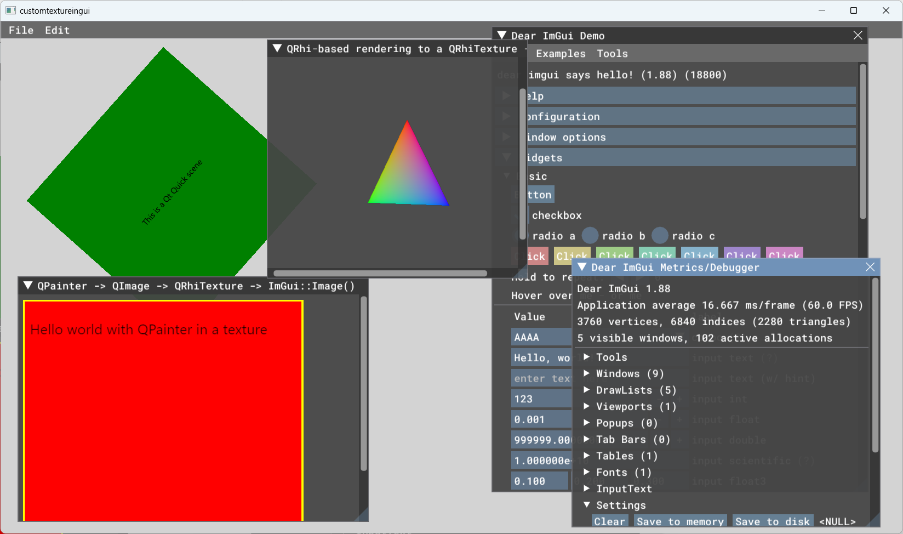

New integration of Qt Quick and Dear ImGui. Requires Qt 6.4 or newer.

- This now hides the Qt Quick threading model completely, and is a QQuickItem,
meaning proper input event processing (keyboard focus, stacking order for mouse
events, etc.).

- The Qt Quick scenegraph integration happens via QSGRenderNode, which we now
try to use in the most optimal way, while getting proper stacking with other
items in the scene. (it won't implicitly disable the renderer's opaque pass as
rendernodes traditionally would, but this is only available with Qt 6.5 and
newer; whereas with older Qt 6 versions it all will still work, just slightly
less optimally)

- Unlike earlier attempts, the item size and the window device pixel ratio are
respected as well. (NB following the item geometry and transform is still
limited by design, e.g. scaling the item or rotating around any axis will lead
to incorrect scissoring)

- Applications can subclass QRhiImguiItem, reimplement frame() to do ImGui
stuff (safely on the main thread, even if the Qt Quick rendering has its own
render thread), register the item via the Qt 6 facilities (QML_NAMED_ELEMENT,
qt_add_qml_module), then instantiate somewhere in the QML scene.

- Input is migrated to the new API in 1.87+. (the key code mapping table may
still be incomplete, though)

- Additionally, plain QWindow applications or anything that renders with QRhi
  (e.g., from Qt 6.7 on, QRhiWidget and QQuickRhiItem) are supported too.
  See the simplewindow and imguiinrhiwidget examples.

(screenshot of the customtextureingui example)
